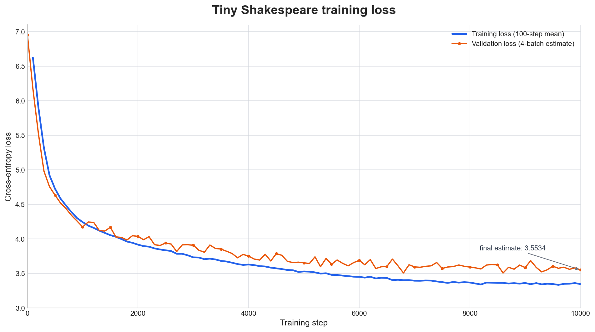

# Tiny LM from Scratch

[](https://github.com/Johnyyy1/tiny-lm-from-scratch/actions/workflows/tests.yml)

A small language model built from scratch in PyTorch, including a byte-level BPE tokenizer, decoder-only Transformer, training loop, checkpointing, evaluation, and text generation.

The purpose of this project is to understand how the main components of a language model work together without relying on high-level Transformer or tokenizer libraries.

## Overview

The project implements the complete text-generation pipeline:

```text
Raw text
   ↓
BPE tokenizer
   ↓
Token IDs
   ↓
Decoder-only Transformer
   ↓
Next-token probabilities
   ↓
Generated text
```

It is designed as an educational implementation rather than a production-ready language-model framework.

## Features

* Byte-level BPE tokenizer with complete UTF-8 coverage
* Tokenizer training on arbitrary text datasets
* Decoder-only Transformer implemented in PyTorch
* Multi-head causal self-attention
* Token and positional embeddings
* Feed-forward Transformer blocks
* Weight tying between embeddings and output projection
* AdamW optimizer with explicit betas and weight decay
* Gradient clipping
* Learning-rate warmup and cosine decay
* Mixed-precision training where supported
* Training and validation loss evaluation
* Resumable checkpoints
* KV cache for faster text generation
* Temperature and top-k sampling
* CUDA, Apple Silicon and CPU support

## Architecture

The model follows a decoder-only Transformer architecture similar to small GPT-style language models.

Each Transformer block uses a pre-norm layout:

```text
Input
  ├── Layer normalization → causal multi-head self-attention → residual addition
  └── Layer normalization → feed-forward network → residual addition
```

The causal attention mask prevents each token from accessing future tokens.

The model predicts the next token for every position in the input sequence.

## Tokenizer

The tokenizer builds its vocabulary using byte-level Byte Pair Encoding.

BPE starts with all 256 possible byte values plus an end-of-text token. It then
repeatedly merges frequent adjacent token pairs into new tokens. Text is encoded
as UTF-8 before applying the learned merges, so unseen characters and emoji do
not cause out-of-vocabulary errors.

For example:

```text
l o w e r
l o w er
lo w er
low er
lower
```

Frequent byte sequences gradually become individual tokens.

The tokenizer supports:

* vocabulary training,
* text encoding,
* token decoding,
* configurable vocabulary size,
* tokenizer serialization,
* tokenizer statistics.

A basic tokenizer invariant is:

```python
tokenizer.decode(tokenizer.encode(text)) == text
```

## Installation

Clone the repository:

```bash
git clone https://github.com/Johnyyy1/tiny-lm-from-scratch.git
cd tiny-lm-from-scratch
```

Create a virtual environment:

```bash
python -m venv .venv
```

Activate it on macOS or Linux:

```bash
source .venv/bin/activate
```

Activate it on Windows:

```powershell
.venv\Scripts\activate
```

Install the project and development dependencies:

```bash
pip install -e ".[dev]"
```

This also installs the `tiny-lm` command.

`pyproject.toml` is the single source of truth for runtime and development
dependencies. For a runtime-only installation, use `pip install -e .`.

## Dataset

The model can be trained on any UTF-8 text file.

Place the dataset inside the project, for example:

```text
data/input.txt
```

A small dataset such as Tiny Shakespeare is suitable for testing the implementation:

```bash
curl -o data/input.txt \
  https://raw.githubusercontent.com/karpathy/char-rnn/6f9487a6fe5b420b7ca9afb0d7c078e37c1d1b4e/data/tinyshakespeare/input.txt
```

Small datasets are useful for validating the pipeline, but they will not produce a generally capable language model.

Dataset lines are joined with end-of-text tokens and packed into contiguous
training windows. Long and empty lines are not discarded, and padding is
limited to the final partial window in each split.

## Training

Train the tokenizer and language model:

```bash
tiny-lm train \
  --data-file data/input.txt \
  --vocab-size 1024 \
  --max-steps 5000
```

Example with a smaller model:

```bash
tiny-lm train \
  --data-file data/input.txt \
  --vocab-size 512 \
  --seq-len 256 \
  --d-model 256 \
  --num-heads 4 \
  --num-layers 4 \
  --max-steps 5000
```

During training, the program reports:

* current step,
* training loss,
* validation loss,
* gradient norm,
* learning rate,
* elapsed time,
* estimated completion progress.

## Resume training

Training can be resumed from a saved checkpoint:

```bash
tiny-lm resume checkpoints/latest.pt \
  --max-steps 10000
```

Checkpoints include:

* model parameters,
* optimizer state,
* training step,
* model configuration,
* tokenizer state,
* recorded metrics,
* random-number-generator states.

## Generate text

Generate text from a trained checkpoint:

```bash
tiny-lm generate checkpoints/latest.pt \
  --prompt "ROMEO:" \
  --max-new-tokens 200
```

Generation can be controlled using temperature and top-k sampling:

```bash
tiny-lm generate checkpoints/latest.pt \
  --prompt "ROMEO:" \
  --max-new-tokens 200 \
  --temperature 0.8 \
  --top-k 50
```

Lower temperatures produce more predictable output.

Higher temperatures produce more varied but less reliable output.

## Evaluation

Evaluate a trained checkpoint:

```bash
tiny-lm evaluate checkpoints/latest.pt \
  --data-file data/input.txt
```

The evaluation reports loss and perplexity on the selected dataset split.

## Example results

Results from a completed Tiny Shakespeare training run:

| Dataset | Tokenizer vocabulary | Parameters | Training steps | Training time | Validation loss | Perplexity | Device |
| --- | ---: | ---: | ---: | ---: | ---: | ---: | --- |
| Tiny Shakespeare | 1,024 | 938,752 | 10,000 | 3m 34.5s | 3.578311 | 35.812996 | Apple M4 16 GB (MPS) |

Validation loss and perplexity were calculated over every usable token in the
complete packed validation split.

### Reproduce the benchmark

Download the exact dataset used by the reference run:

```bash
mkdir -p data
curl -o data/input.txt \
  https://raw.githubusercontent.com/karpathy/char-rnn/6f9487a6fe5b420b7ca9afb0d7c078e37c1d1b4e/data/tinyshakespeare/input.txt
```

SHA-256: `86c4e6aa9db7c042ec79f339dcb96d42b0075e16b8fc2e86bf0ca57e2dc565ed`

Run the complete training configuration:

```bash
tiny-lm train \
  --data-file data/input.txt \
  --vocab-size 1024 \
  --seq-len 128 \
  --d-model 128 \
  --d-ff 512 \
  --num-heads 4 \
  --num-layers 4 \
  --batch-size 16 \
  --max-steps 10000 \
  --eval-interval 100 \
  --eval-batches 4 \
  --learning-rate 0.0003 \
  --dropout 0.1 \
  --max-token-length 40 \
  --seed 42 \
  --no-compile \
  --device mps \
  --checkpoint checkpoints/benchmark.pt \
  --checkpoint-interval 10000
```

Calculate the reported full-split metrics:

```bash
tiny-lm evaluate checkpoints/benchmark.pt \
  --data-file data/input.txt \
  --split validation \
  --batch-size 16 \
  --device mps
```

Reference environment:

* Commit: `bd2aa73`
* PyTorch: `2.8.0`
* macOS: `15.6`
* Hardware: Apple M4, 16 GB unified memory

The loss curves use a 100-step moving average for training loss and the
four-batch validation estimate recorded every 100 steps:



### Generated sample

Sampling command:

```bash
tiny-lm generate checkpoints/benchmark.pt \
  --prompt "KING RICHARD II:" \
  --max-new-tokens 120 \
  --temperature 1.0 \
  --top-k 50 \
  --seed 7 \
  --continue-after-eot \
  --device mps
```

```text
KING RICHARD II:
Suk, humbertured ster of the king,
When, the criding face that numble dathing in the golds
Of my father digread tending night.

BENVOLIO:
Good my lordlet's father Englander,
Unand not heard as you may as you proyer,
Who we that did not doubt under much asken
Than intering
```

This is unedited output. `--continue-after-eot` renders learned text boundaries
as newlines instead of stopping at the first boundary.

## Project structure

```text
.
├── src/tiny_lm/
│   ├── tokenizer.py
│   ├── data.py
│   ├── model.py
│   ├── attention.py
│   ├── training.py
│   ├── evaluation.py
│   ├── generation.py
│   ├── checkpoint.py
│   ├── config.py
│   └── cli.py
├── tests/
│   ├── test_tokenizer.py
│   ├── test_data.py
│   ├── test_model.py
│   ├── test_generation.py
│   ├── test_training.py
│   └── test_checkpoint.py
├── assets/
│   └── training-loss.png
├── .github/workflows/tests.yml
├── README.md
├── CLI.md
├── pyproject.toml
├── data/
└── checkpoints/
```

Each module has one primary responsibility, so the tokenizer algorithm can be
read independently from the CLI, training loop, and checkpoint format.

Run the same checks used by CI:

```bash
ruff check .
ruff format --check .
python -m pytest
```

## What I learned

This project helped me understand:

* how BPE vocabularies are created,
* how text is converted into model inputs,
* how causal self-attention works,
* how Transformer blocks process sequences,
* how next-token prediction is trained,
* how model checkpoints restore training,
* how autoregressive text generation works,
* why KV caching improves generation performance,
* how sampling parameters affect generated text.

## Limitations

* Intended for education rather than production use
* Trained on relatively small datasets
* No distributed or multi-GPU training
* No instruction tuning
* No preference optimization
* No advanced positional embeddings such as RoPE
* Generated text quality depends heavily on training data and compute

## Roadmap

* [x] BPE tokenizer
* [x] Decoder-only Transformer
* [x] Training and validation loop
* [x] Checkpoint saving and loading
* [x] Autoregressive text generation
* [x] KV cache
* [x] Modular `src/tiny_lm` package
* [x] Automated tests and CI
* [x] Reproducible benchmark and training-loss chart
* [x] Add byte-level BPE
* [x] Pack the dataset into contiguous token windows
* [x] Add benchmark results
* [ ] Compare the tokenizer with a reference implementation

## Acknowledgements

This project was inspired by educational implementations of tokenizers and Transformer language models, including Andrej Karpathy's neural-network and language-model projects.

The implementation was written as a learning exercise and is not intended to reproduce any specific library.

## License

MIT License
